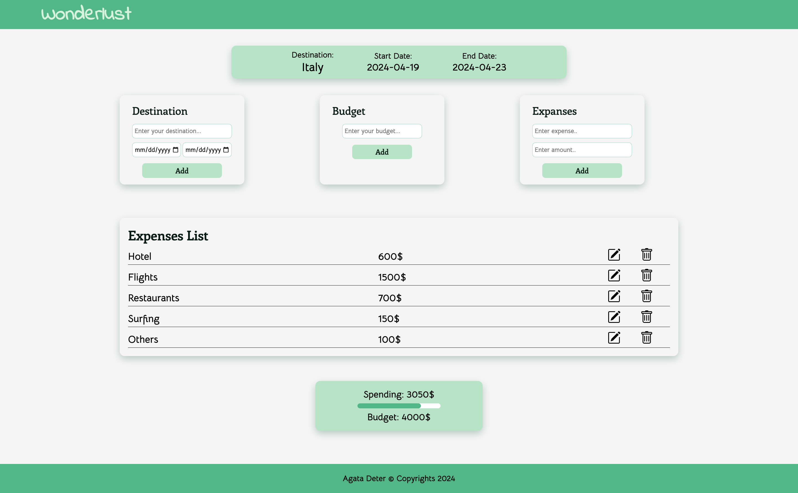

# SBA-316

Skill based assessment for the Document Object Model

## Table of Contents

- [About](#about)
- [Technologies](#technologies)
- [Future app possibilities](#future-app-possibilities)
- [Screenshots](#screenshots)
- [Site link](#site-link)
- [License](#license)

## About

Tha website is the task from Software Engineering Bootcamp.
 
The requirements were to create single-page website and practice DOM manilpulation plus to use HTML and JavaScript forms validation, use BOM methods from window object.
 The app has single page, user can log his upcomming trip and set the budget for it.
 The user can add expenses below or equil to the budget he set up.

 I was using `FLEXBOX` and `GRID` for layout following `responsive design` practices.
 The 'Destination Form' is using HTML validation, the other two are using JavaScript validaton method. 

1. Validation for the Destination:

- name is required
- start day can't be before today date

2. Validation for the Destination:

- budget has to be fill out before adding expenses
- value is required
- value is up to two decimal places
- if wrong the message will pop up below the input

3. Validation for Expanses:

- expanse amount is up to two decimal places
- expance and amount are required
- expance can't exceed the budget or sum of all expenses can't exceed the budget

The app allows user to update the expense after adding to the list. The dialog will show up and the validation is the same as for the expenses. 
All the information is saved in user window.localStorage. 
The user can see at the end, how much he spend money and see the visualisation of percent used.

## Technologies

- HTML
- CSS
- JavaScript
- LocalStorage

## Future app possibilities

There are possibilities to expand app for more features like:

1. Refactoring to React
2. Or using webpack to bundle files
3. Change single-page webiste to be more complex, many-sites

## Screenshots

1. Home page:
    
   

## Site link

https://agata10.github.io/SBA-316/

## License

[LICENSE](LICENSE)
